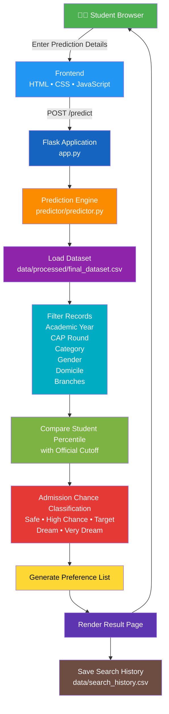

<div align="center">

# 🎓 MAHA-DSE College Predictor

### Predict Your Maharashtra Direct Second Year Engineering Admission

*A smart, data-driven Flask web application powered by official Maharashtra CAP Round cutoff data*

---

[](https://www.python.org/)
[](https://flask.palletsprojects.com/)
[](https://developer.mozilla.org/en-US/docs/Web/HTML)
[](https://developer.mozilla.org/en-US/docs/Web/CSS)
[](https://developer.mozilla.org/en-US/docs/Web/JavaScript)
[](https://opensource.org/licenses/MIT)

---

[🚀 Live Demo](#) &nbsp;|&nbsp;
[📖 Documentation](#-table-of-contents) &nbsp;|&nbsp;
[🐛 Report Bug](https://github.com/abhij1401/maha-dse-predictor/issues) &nbsp;|&nbsp;
[✨ Request Feature](https://github.com/abhij1401/maha-dse-predictor/issues)

</div>

---

## 🌟 Overview

**MAHA-DSE College Predictor** is a professional Flask-based web application designed to assist Maharashtra Diploma students in predicting their engineering college admission chances under the **Direct Second Year (DSE)** lateral entry scheme.

The predictor processes student-specific inputs — including DSE percentile, category, gender, domicile, preferred branches, CAP round, and academic year — and compares them against **official Maharashtra State CET Cell CAP Round cutoff datasets** to generate accurate, tier-classified admission predictions.

> 💡 **Why this project?**  
> Every year, thousands of diploma students struggle to shortlist colleges before CAP counselling begins. MAHA-DSE College Predictor solves this by giving data-backed predictions — completely free and accessible.

---

## ✨ Features

<details>
<summary><strong>🖥️ Frontend Features</strong> (click to expand)</summary>

| Feature | Description |
|---|---|
| **Modern Landing Page** | Clean, professional hero section with call-to-action |
| **Hero Section** | Engaging banner with animated introduction |
| **About Section** | Project purpose and mission description |
| **Features Section** | Visual cards highlighting key capabilities |
| **How It Works** | Step-by-step visual guide for students |
| **FAQ Section** | Frequently asked questions with accordion UI |
| **Contact Section** | Contact form and developer information |
| **Responsive UI** | Fully mobile-responsive across all screen sizes |
| **Loading Animation** | Smooth animated loader during prediction processing |
| **Print Results** | One-click result printing functionality |

</details>

<details>
<summary><strong>🔍 Prediction Form Features</strong> (click to expand)</summary>

| Feature | Description |
|---|---|
| **Dynamic Branch Loading** | Branches load automatically based on selected academic year via AJAX |
| **Academic Year Selection** | Choose between available CAP years (e.g., 2022, 2023, 2024) |
| **CAP Round Selection** | Filter results by CAP Round 1, 2, or 3 |
| **Category Filtering** | Supports all Maharashtra reservation categories (OPEN, OBC, SC, ST, VJ, NT, EWS, etc.) |
| **Gender Filtering** | Filter by Male, Female, or Transgender options |
| **Domicile Filtering** | Maharashtra Home University, Outside Home University filters |
| **Multi-Branch Selection** | Students can select multiple preferred engineering branches simultaneously |

</details>

<details>
<summary><strong>⚙️ Predictor Engine Features</strong> (click to expand)</summary>

| Feature | Description |
|---|---|
| **Admission Chance Calculation** | Compares student percentile with official cutoff data |
| **5-Tier Classification** | Safe / High Chance / Target / Dream / Very Dream |
| **College Cards** | Beautifully formatted result cards per college |
| **Search History** | Previous predictions stored and accessible locally |
| **Local Storage** | Searches saved in browser without backend dependency |
| **Flask REST APIs** | Backend APIs for all dynamic data loading and predictions |
| **Health Endpoint** | `/health` API for uptime and status monitoring |

</details>

---

## 🛠️ Tech Stack

| Layer | Technology | Purpose |
|---|---|---|
| **Backend** |  Python 3.10+ | Core programming language |
| **Web Framework** |  Flask 2.x | HTTP routing, API handling, templating |
| **Templating** | Jinja2 | Server-side HTML rendering |
| **Frontend** |  HTML5 | Page structure and semantics |
| **Styling** |  CSS3 | Responsive design and animations |
| **Interactivity** |  Vanilla JS | Dynamic UI, AJAX calls, local storage |
| **Data Processing** |  Pandas | Dataset loading, filtering, analysis |
| **Numerical Ops** |  NumPy | Percentile comparisons and calculations |
| **Dataset** | CSV Files | Official Maharashtra CAP cutoff data |

---


## 📁 Folder Structure

```text
Maha-DSE/
│
├── app.py                             # Main Flask application and route definitions
├── README.md                          # Project documentation
├── requirementt.txt                   # Python dependencies
│
├── data/                              # Project datasets
│   ├── raw/                           # Original CAP cutoff PDF files
│   │   ├── DSE_CAP_ROUND_I_CUTOFF_2024_25.pdf
│   │   ├── DSE_CAP_ROUND_II_CUTOFF_2024_25.pdf
│   │   └── README.md                  # Raw dataset information
│   │
│   ├── processed/                     # Processed CSV datasets
│   │   ├── cap_round_1.csv
│   │   ├── cap_round_2.csv
│   │   ├── clean_cap_round_1.csv
│   │   ├── clean_cap_round_2.csv
│   │   ├── cutoff_data.csv
│   │   └── final_dataset.csv          # Final dataset used by the prediction engine
│   │
│   └── search_history.csv             # Stores prediction/search history
│
├── logs/                              # Application and preprocessing logs
│   ├── clean_data.log
│   ├── extract_pdf.log
│   ├── merge_data.log
│   └── predictor.log
│
├── parser/                            # Dataset preparation pipeline
│   ├── extract_pdf.py                 # Extracts tables from CAP cutoff PDFs
│   ├── clean_data.py                  # Cleans and standardizes extracted data
│   ├── merge_data.py                  # Merges cleaned datasets into a final dataset
│   ├── docs/
│   │   └── dataset_format.md          # Dataset format documentation
│   └── data/
│       └── processed/                 # Temporary processed files
│
├── predictor/                         # College prediction engine
│   ├── predictor.py                   # Core prediction logic and recommendation engine
│   └── __pycache__/                   # Python bytecode cache
│
├── templates/                         # Flask HTML templates
│   ├── base.html                      # Base layout shared across pages
│   ├── index.html                     # Landing page and prediction form
│   ├── result.html                    # Prediction results page
│   └── error.html                     # Error page
│
├── static/                            # Static assets
│   ├── css/
│   │   └── style.css                  # Global application stylesheet
│   ├── js/
│   │   └── script.js                  # Frontend logic and UI interactions
│   └── images/                        # Images, logos and other assets
│
└── .gitignore                         # Git ignored files (recommended)
```

### 📂 Directory Overview

| Directory      | Purpose                                                                                                                    |
| -------------- | -------------------------------------------------------------------------------------------------------------------------- |
| **app.py**     | Main Flask application responsible for routing, prediction requests, and rendering templates.                              |
| **data/**      | Stores all raw PDFs, processed CSV datasets, and search history used by the application.                                   |
| **parser/**    | Complete data preprocessing pipeline that extracts, cleans, and merges official CAP cutoff PDFs into a structured dataset. |
| **predictor/** | Core prediction engine that analyzes student inputs and recommends colleges based on official cutoff data.                 |
| **templates/** | HTML templates rendered by Flask, including the landing page, result page, base layout, and error page.                    |
| **static/**    | Contains CSS, JavaScript, and image assets used throughout the web application.                                            |
| **logs/**      | Log files generated during PDF extraction, data cleaning, merging, and prediction processes.                               |

```

---
## 🔄 Predictor Workflow

```text
👨‍🎓 Student
      │
      ▼
┌───────────────────────────────────────────────┐
│           Landing Page (index.html)           │
│      Fill Prediction Form with Details        │
└──────────────────────┬────────────────────────┘
                       │
                       ▼
┌───────────────────────────────────────────────┐
│        Client-Side Validation (JavaScript)    │
│  Validate Required Fields & Input Formats     │
└──────────────────────┬────────────────────────┘
                       │
                       ▼
┌───────────────────────────────────────────────┐
│         Flask Backend (app.py)                │
│        POST /predict Request Handling         │
└──────────────────────┬────────────────────────┘
                       │
                       ▼
┌───────────────────────────────────────────────┐
│      Predictor Engine (predictor.py)          │
└──────────────────────┬────────────────────────┘
                       │
         ┌─────────────┼─────────────────────────────┐
         ▼             ▼             ▼               ▼
┌──────────────┐ ┌──────────────┐ ┌──────────────┐ ┌──────────────┐
│ Load Dataset │ │ Apply Filters│ │ Compare with │ │ Calculate    │
│final_dataset │ │Year, Round,  │ │Official CAP  │ │Admission     │
│     .csv     │ │Category, etc │ │Cutoff Data   │ │Chance Tier   │
└──────┬───────┘ └──────┬───────┘ └──────┬───────┘ └──────┬───────┘
       └────────────────┴───────────────┴────────────────┘
                            │
                            ▼
┌───────────────────────────────────────────────┐
│     Generate College Predictions              │
│  🟢 Safe  🔵 High Chance  🟡 Target            │
│  🟠 Dream  🔴 Very Dream                       │
└──────────────────────┬────────────────────────┘
                       │
                       ▼
┌───────────────────────────────────────────────┐
│      Generate Preference List                 │
│ Rank Colleges Based on Prediction Results     │
└──────────────────────┬────────────────────────┘
                       │
                       ▼
┌───────────────────────────────────────────────┐
│         Render Result Page                    │
│     Save Search History (CSV)                 │
└──────────────────────┬────────────────────────┘
                       │
                       ▼
                👨‍🎓 Student Views Results
```

---

## 🏗️ System Architecture



---

## 📊 Dataset Preparation Pipeline

```text
Official Maharashtra DSE CAP Cutoff PDFs
                │
                ▼
      extract_pdf.py
                │
                ▼
      clean_data.py
                │
                ▼
      merge_data.py
                │
                ▼
      final_dataset.csv
                │
                ▼
      Predictor Engine
                │
                ▼
      College Prediction
                │
                ▼
      Preference List Generator
```

## 🚀 Installation

```bash
# 1. Clone the repository
git clone https://github.com/abhij1401/maha-dse-predictor.git
cd maha-dse-predictor

# 2. Create and activate virtual environment
python -m venv venv
venv\Scripts\activate        # Windows
source venv/bin/activate     # macOS / Linux

# 3. Install dependencies
pip install -r requirements.txt

# 4. Set environment variables
cp .env.example .env
# Edit .env → set SECRET_KEY, FLASK_ENV=development, FLASK_DEBUG=True

# 5. Run the application
python app.py

# 6. Open browser
# http://127.0.0.1:5000
```

---

## 📖 Usage

1. Open `http://127.0.0.1:5000` in your browser
2. Click **Predict Now** from the landing page
3. Enter your **DSE Percentile** (0–100)
4. Select **Academic Year**, **CAP Round**, **Category**, **Gender**, **Domicile**
5. Multi-select your preferred **Engineering Branches**
6. Click **Predict Colleges**
7. View college cards with tier badges on the results page
8. Print results or view past searches from the History page

---

## 🎯 Prediction Tiers

> **Formula:** `delta = student_percentile − college_cutoff_percentile`

| Badge | Tier | Condition | Meaning |
|---|---|---|---|
| 🟢 | **Safe** | delta ≥ +10 | Very high probability of admission |
| 🔵 | **High Chance** | +5 ≤ delta < +10 | High probability of admission |
| 🟡 | **Target** | 0 ≤ delta < +5 | Moderate probability — apply confidently |
| 🟠 | **Dream** | −5 ≤ delta < 0 | Low probability — aspirational choice |
| 🔴 | **Very Dream** | delta < −5 | Stretch goal — very low probability |

---

## 🕓 Search History

- Every prediction is automatically saved to **browser localStorage**
- No login or database required
- Stores percentile, year, round, category, gender, domicile, branches and timestamp
- View all past searches at `/history`
- Delete individual entries or clear all history with one click
- Future release will add SQLite/PostgreSQL backend with user accounts for cross-device history

---

## 🔐 Security

| Area | Current | Planned |
|---|---|---|
| Input Validation | Client-side JS + Server-side Python | Pydantic schema validation |
| XSS | Jinja2 auto-escaping enabled | Content Security Policy headers |

---

## ⚡ Performance

- Dataset loaded **once at startup** — no file I/O per request
- All filtering runs as **vectorized Pandas operations** — fast on large datasets
- **AJAX branch loading** — no full page reload on year change
- **localStorage history** — zero server cost for reading past searches
- Minimal dependencies — Flask keeps startup and response times lean

---


## 🤝 Contributing

Contributions are welcome! Whether you're fixing bugs, improving the prediction engine, enhancing the UI, updating datasets, or improving documentation, every contribution is appreciated.

### Getting Started

```bash
# 1. Fork the repository

# 2. Clone your fork
git clone https://github.com/YOUR_USERNAME/Maha-DSE.git

# 3. Navigate to the project
cd Maha-DSE

# 4. Create a new branch
git checkout -b feature/your-feature-name

# 5. Make your changes

# 6. Commit your changes
git commit -m "feat: add your feature"

# 7. Push to GitHub
git push origin feature/your-feature-name

# 8. Open a Pull Request
```

### Contribution Guidelines

* Follow **PEP 8** coding standards for Python.
* Write clean, readable, and well-documented code.
* Use meaningful commit messages (Conventional Commits are recommended).
* Update the README if you add or modify features.
* Keep HTML, CSS, and JavaScript code organized and consistent.
* Verify that the application runs correctly before submitting a Pull Request.
* If you add new datasets, ensure they follow the existing dataset format.

### Ways to Contribute

* 🐞 Fix bugs
* ✨ Add new features
* 🎨 Improve the UI/UX
* 📊 Update Maharashtra DSE cutoff datasets
* 📖 Improve documentation
* ⚡ Optimize prediction performance
* 🤖 Enhance the Preference List Generator
* 🌐 Add multilingual support (Marathi, Hindi, English)

---

## 📄 License

MIT License — Copyright (c) 2024 Abhishek Jadhav

Permission is hereby granted, free of charge, to any person obtaining a copy of this software to use, copy, modify, merge, publish, distribute, sublicense, and/or sell copies subject to the condition that the above copyright notice is included in all copies. The software is provided as-is without warranty of any kind.

---

## 👨‍💻 Author

<div align="center">


### Abhishek Jadhav
*Full Stack Developer · Open Source Enthusiast · Maharashtra, India*

[](https://github.com/abhij1401)
[](https://linkedin.com/in/abhishek-jadhav-a1085a2bb)

---


*Made with ❤️ for Maharashtra Diploma Students · © 2024 Abhishek Jadhav*

</div>
```
